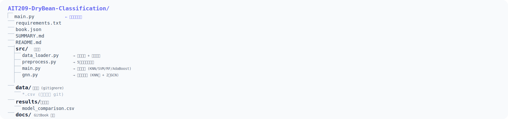

# 第六章 · 系统工程实现

本章展示项目的系统实现，包括架构设计、模块划分和运行方式。

---

## 6.1 项目总览

项目采用**模块化架构**，由 `main.py` 统一调度，各模块职责清晰：

<div align="center">
  
</div>

### 目录结构

<div align="center">
  
</div>

---

## 6.2 模块说明

### `data_loader.py` — 数据加载层

职责单纯：读 CSV、提供标签映射表。

```python
from data_loader import load_data, get_class_mapping

train, val, test = load_data()     # 返回三个 DataFrame
mapping = get_class_mapping()      # {'dermason': 'DERMASON', ...}
```

不包含任何清洗逻辑——那是 preprocess 的职责。

### `preprocess.py` — 预处理层

核心模块。对外暴露一个函数 `preprocess_pipeline()`，内部串联 5 个步骤：

```
preprocess_pipeline()
    ├── clean_labels()       # 25→7 标签归一化
    ├── fix_solidity()       # "?"→NaN
    ├── fix_compactness()    # 去" cm"
    ├── impute_missing()     # 中位数填充
    └── StandardScaler       # 标准化
```

**关键设计**：在训练集上 fit，在验证/测试集上只 transform——防止数据泄露。

```python
# 正确做法
scaler = StandardScaler()
X_train = scaler.fit_transform(X_train)   # fit + transform
X_test  = scaler.transform(X_test)        # 只用 transform
```

### `main.py` — 调度层

项目的入口，组织 KNN、SVM、Random Forest、AdaBoost 四种算法的训练和评估。

```python
# 1. 预处理
X_train, X_val, X_test, y_train, y_val, y_test, le, scaler, features = \
    preprocess_pipeline()

# 2. 定义四个模型
models = [
    ("KNN (k=5)", KNeighborsClassifier(...)),
    ("SVM (RBF, C=10)", SVC(...)),
    ("Random Forest (100 trees)", RandomForestClassifier(...)),
    ("AdaBoost (50 rounds)", AdaBoostClassifier(...)),
]

# 3. 逐一训练 + 评估
for name, model in models:
    model.fit(X_train, y_train)
    # 计算 train/val/test 精度、F1、过拟合、推理速度
    ...

# 4. 输出排名表 + 保存 CSV
df.to_csv("results/model_comparison.csv")
```

### `gnn.py` — 图卷积网络模块

课外前沿算法。通过 KNN 构建样本间图结构，使用 2 层 GCN 进行节点分类。

```bash
# 单独运行 GCN 训练
py src/gnn.py
```

不依赖 PyTorch Geometric，所有 GCN 层为纯 PyTorch 手动实现。

---

## 6.3 运行演示

### 环境准备

```bash
pip install -r requirements.txt
```

### 一键运行

```bash
py src/main.py
```

### 运行输出

```
========================================================================
  Dry Bean Classification - Full Pipeline
  AIT209 机器学习与项目实践 · 期末作业
========================================================================

[1/3] Loading & preprocessing data ...
  原始数据: train=(9527, 17), val=(1347, 17), test=(2737, 17)
  预处理完成: X_train=(9527, 16), X_val=(1347, 16), X_test=(2737, 16)
  Classes: ['BARBUNYA', 'BOMBAY', 'CALI', 'DERMASON', 'HOROZ', 'SEKER', 'SIRA']

[2/3] Training models ...
  -- KNN (k=5) --
    Train: 93.86% | Val: 91.61% | Test: 91.78% | Speed: 517ms
  -- SVM (RBF, C=10) --
    Train: 93.67% | Val: 92.72% | Test: 93.31% | Speed: 610ms
  -- Random Forest (100 trees) --
    Train: 98.32% | Val: 91.91% | Test: 92.36% | Speed: 45ms
  -- AdaBoost (50 rounds) --
    Train: 90.29% | Val: 88.57% | Test: 89.84% | Speed: 30ms

[3/3] Final Report
  Rank  Algorithm                    Test Acc   Overfit   Speed
  1     SVM (RBF, C=10)              0.9331     +0.0095   610.6 ms
  2     Random Forest (100 trees)    0.9236     +0.0641    45.2 ms
  3     KNN (k=5)                    0.9178     +0.0225   517.1 ms
  4     AdaBoost (50 rounds)         0.8984     +0.0172    29.8 ms

  Best Model: SVM (RBF, C=10) → Test Accuracy = 0.9331
========================================================================
```

---

## 6.4 设计原则总结

| 原则 | 实现 |
|------|------|
| **单一入口** | 所有功能从 `py src/main.py` 启动 |
| **模块分离** | 加载 → 清洗 → 训练各司其职 |
| **防数据泄露** | fit 仅用训练集，transform 用于全量 |
| **可复现** | 所有 random_state=42 |
| **命令行执行** | 无 GUI，适合自动化 |
| **数据不入库** | data/ 和 models/ 通过 .gitignore 排除 |
